## 🎬 CinePesado Bot
Bot de Telegram que recomienda películas y conversa de forma natural usando FastAPI y un modelo LLM vía OpenRouter. Utiliza una base de datos en Neon para guardar el contexto del usuario y tiene un endpoint `/ping` para monitoreo del servicio con herramientas como UptimeRobot.

#### 🚀 Características
* 📩 Webhook de Telegram: Recibe y responde mensajes automáticamente desde tu bot.

* 👋 Reconocimiento de saludos: Detecta saludos comunes y responde con un mensaje personalizado.

* 🤖 Conversación natural: Interpreta preguntas o frases del usuario y responde de manera fluida, con validación previa del mensaje.

* 🎬 Recomendaciones de películas: Sugiere películas basadas en gustos, géneros o estados de ánimo.

* 🧠 IA potenciada con LLM (OpenRouter): Usa un modelo de lenguaje para generar respuestas contextuales y coherentes.

* 🖋️ Formato enriquecido: Usa HTML para mejorar la presentación de los mensajes en Telegram (negritas, cursivas, emojis, etc.).

* 📚 Almacenado en base de datos PostgreSQL por medio de Neon Tech y lectura de historial para darle un contexto al modelo LLM.

* ☁️ Deploy simple: Preparado para desplegar fácilmente en Render, con soporte para monitoreo vía /ping.

#### 📁 Estructura del proyecto

```
app/
  main.py           # FastAPI app, webhook, ping
  bot/
    handlers.py     # Lógica para manejar mensajes y respuestas
    telegram.py     # Funciones para enviar mensajes y acciones a Telegram
  core/
    config.py       # Configuración y carga de variables de entorno
    exception_handlers.py
    exceptions.py   # Excepciones
    utils.py        # Funciones auxiliares (saludos, parseo, limpieza, validación)
  data/
    prompt.py       # Prompts y textos del bot
  db/
    chat_history.py # Funcionalidad en base de datos
    database.py     # Conexión y Sesión
  models/
    chat_history.py # Modelo para creación de tabla
  routes/
    telegram.py     # Rutas FastAPI para webhook y consultar historial
  schemas/
    chat_history.py #  Lectura y validación de tipo de datos en objetos
  services/
    llm_agent.py    # Lógica para llamar a OpenRouter API
requirements.txt    # Dependencias
Procfile            # Comando para despliegue en Render
```

#### 🔐 Archivo `.env` necesario

```env
TELEGRAM_TOKEN=telegram_token
OPENROUTER_API_KEY=openrouter_key
OPENROUTER_MODEL=modelo
TELEGRAM_API_URL=https://api.telegram.org/bot
BASE_URL=URL de render
DATABASE_URL=URL de base de datos
```

#### 🧪 Instalación y Ejecución

##### Instalar dependencias

```bash
pipenv install --dev
```

##### Ejecutar servidor de desarrollo

```bash
pipenv run uvicorn app.main:app --reload
```

#### ☁️ Despliegue
El bot está desplegado en Render.com. Usa un webhook conectado a Telegram para recibir los mensajes y responderlos en tiempo real.

#### 📚 Historial y contexto de conversación
- Se usa PostgreSQL (vía Neon) y SQLAlchemy Async para almacenar las conversaciones.
- Esto permite recuperar el contexto y generar respuestas más personalizadas.
- Incluye un endpoint `/telegram/history/{chat_id}` para consultar el historial.

#### 📡 Monitorización del servicio

Se expone un endpoint `/ping` para verificar que el bot está activo y responder a herramientas de monitoreo como [UptimeRobot](https://uptimerobot.com/?rid=62d4f0a7928e50).

#### ✒️ ¿Cómo funciona?

1. Telegram envía un mensaje al webhook (`routes/telegram.py`).
2. Se valida y limpia el mensaje recibido (`validate_message` en `utils.py`).
3. Se recupera el historial del chat desde la base de datos (`db/chat_history.py`) para dar contexto.
4. Se llama a OpenRouter para generar la respuesta (`services/llm_agent.py`).
5. Se almacena el mensaje y respuesta en la base de datos (`db/chat_history.py`).
6. Se envía la respuesta al usuario vía Telegram (`bot/telegram.py`).

#### 🧠 Flujo del bot

```mermaid
sequenceDiagram
    participant T as Usuario (Telegram)
    participant F as FastAPI Webhook
    participant V as Validación
    participant D as BD Neon (PostgreSQL)
    participant C as Construcción de contexto
    participant L as LLM vía OpenRouter
    participant G as Guardado y respuesta

    T->>F: Enviar mensaje
    F->>V: Validar mensaje
    V->>D: Obtener historial reciente
    D-->>C: Últimos mensajes
    C->>L: Enviar contexto a LLM
    L-->>C: Recibir respuesta
    C->>G: Guardar en base de datos
    G->>D: Insertar nuevo registro
    G->>T: Enviar respuesta a Telegram
```

#### 🛠️ Tecnologías usadas
* Python 3.11+
* FastAPI
* PostgreSQL (Neon)
* SQLAlchemy Async
* OpenRouter (deepseek, gpt-4, etc.)
* Telegram Bot API

#### 📜 Licencia
MIT © [vicogarcia16](https://github.com/vicogarcia16)
